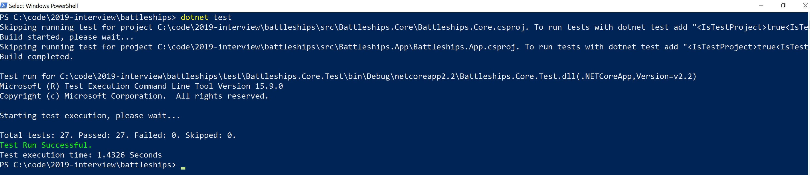
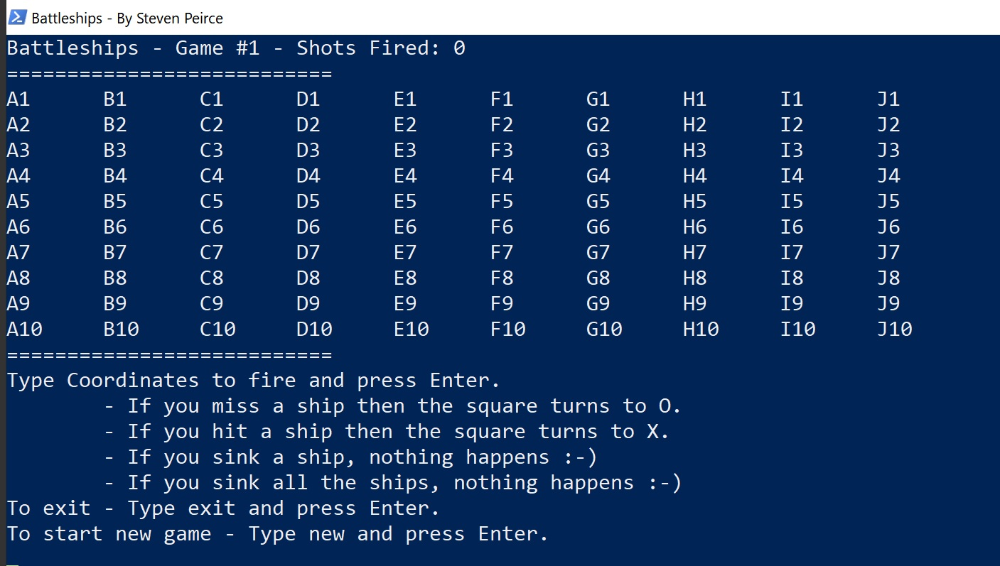

# Battleships

Practical: https://medium.com/guestline-labs/hints-for-our-interview-process-and-code-test-ae647325f400

I wrote this following TDD. I timeboxed about 3 hours to complete the challenge.
I enjoyed the test - it is a nice little challenge.

## Limitations
- I did not have time to implement the logic to randomly place the ships, as such they will be in the same place each time.
- I did not have time to detect when ships are sunk.
- I rushed the console application at the end, this needs tidying.

## Approach

I wrote this code following TDD in the Battleships.Core project.

I started with just the `Game` class - as I continued development it felt like there were 2 responsibilities so I split it.
- `Game` is used to orchestrate the game - this is what the client interacts with.
- `Grid` is used to manage the state of the grid

## Run the tests

Ensure you have dotnet core installed.
From command line run: `dotnet test`

## Run the app
Ensure you have dotnet core installed.
From command line run: `dotnet run --project .\src\Battleships.App\`

> You might have to adjust the `\` accordingly if you use bash.

> Hint: The ships *might* be in the top left corner!

## Update 1 - Random Ship Placement

Additional time spent: ~1 hour.

I have now implemented the random ship placement as requested.

It is very simple.
- `RandomPlacementSelector` is used to find a place where the ship can be placed
  - `FindAvailableSquarePlacements` finds all possible places where the ship could be placed
  - We use random to choose one of these placements at random 

### Future Improvements
I often test against `Square[]` instead of `Grid` - I think this is perhaps a mistake. I would look at if I can tidy these up to make it easier to reason about.
In a few instances I write LINQ expressions to get the `Row` or `Column` - this would possibly be better if I refactored to be methods on the `Grid` class.
